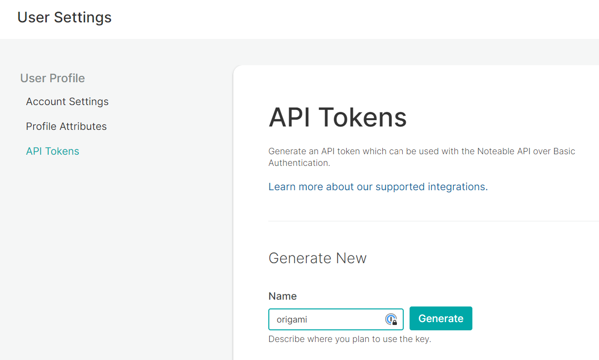
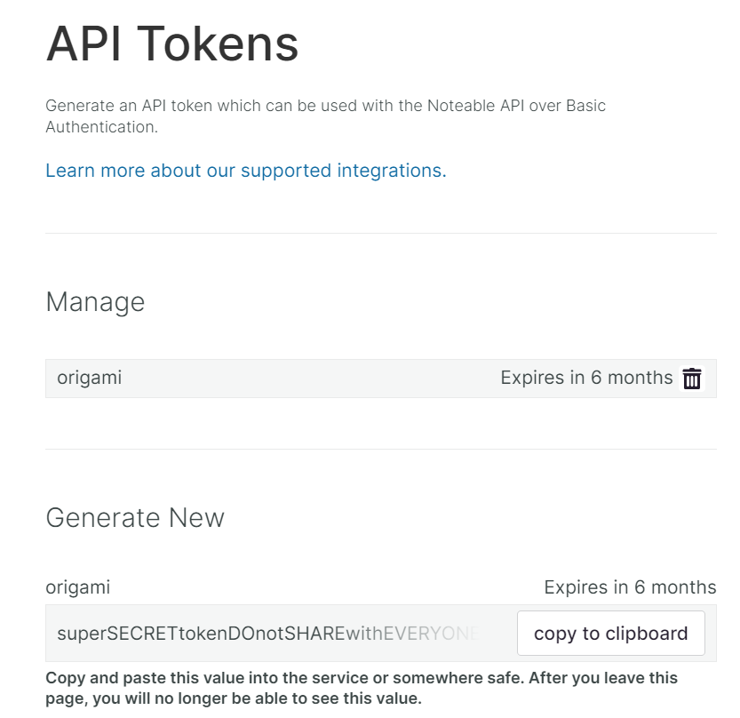

# Origami

<p align="center">

<br />
Launch, edit, and share Jupyter notebooks <i>in automation</i>.
</p>

<p align="center">
<a href="https://github.com/noteable-io/origami/actions/workflows/ci.yaml">
    
</a>
<a href="https://codecov.io/gh/noteable-io/origami" > 
  
 </a>


<a href="https://github.com/psf/black"></a>
</p>

---

[Install](#installation) | [Getting Started](#getting-started) | [Documentation](https://noteable-origami.readthedocs.io) | [License](./LICENSE) | [Code of Conduct](./CODE_OF_CONDUCT.md) | [Contributing](./CONTRIBUTING.md)

<!-- --8<-- [start:intro] -->

## Intro to Origami

Origami is a 🐍 Python library for talking to [Noteable notebooks](https://noteable.io/). This is the official way to access the full breadth of API calls and access patterns in async Python for rich programmatic access to notebooks. You can use [Noteable for free](https://app.noteable.io) with a quick signup.

<!-- --8<-- [end:intro] -->

<!-- --8<-- [start:requirements] -->

## Requirements

Python 3.8+

<!-- --8<-- [end:requirements] -->

<!-- --8<-- [start:install] -->

## Installation

For stable release:

```bash
pip install noteable-origami
```

```bash
poetry add noteable-origami
```

For alpha pre-release:

```bash
pip install noteable-origami --pre
```

<!-- --8<-- [end:install] -->

## Getting Started

> **Note**
> Developer note: For pre-1.0 release information, see the [pre-1.0 README](https://github.com/noteable-io/origami/blob/release/0.0.35/README.md)

### API Tokens
<!-- --8<-- [start:api-tokens] -->
The Noteable API requires an authentication token. You can manage tokens at the Noteable user settings page.

1. Log in to [Noteable](https://app.noteable.io) (sign up is free).
2. In the User Settings tab, navigate to `API Tokens` and generate a new token.

3. Copy the generated token to the clipboard and save in a secure location, to be read into your Python environment later.


The token can be passed directly in to `APIClient` on initialization, or set it as env var `NOTEABLE_TOKEN`.

### Usage
<!-- --8<-- [end:api-tokens] -->

The example below will guide you through the basics of creating a notebook, adding content, executing code, and seeing the output. For more examples, see our [Use Cases](../usage) section.

### Setting up the `APIClient`
<!-- --8<-- [start:api-client] -->
Using the API token you created previously, load it into your notebook environment so it can be passed into the `APIClient` directly. (If you're in [Noteable](https://app.noteable.io), you can create a [Secret](https://docs.noteable.io/product-docs/collaborate/access-and-visibility/secrets-permissions) that can be read in as an environment variable.)

```python
import os
from origami.clients.api import APIClient

api_token = os.environ['NOTEABLE_TOKEN']
api_client = APIClient(api_token)
```
*The `APIClient` is what we'll use to make HTTP requests to Noteable's REST API.*
<!-- --8<-- [end:api-client] -->

### Checking your user information
<!-- --8<-- [start:user-info] -->
```python
user = await api_client.user_info()
user
```
``` {.python .no-copy }
User(
    id=UUID('f1a2b3c4-5678-4d90-ef01-23456789abcd'),
    created_at=datetime.datetime(2023, 1, 1, 0, 0, 0, 0, tzinfo=datetime.timezone.utc),
    updated_at=datetime.datetime(2023, 1, 1, 0, 0, 0, 0, tzinfo=datetime.timezone.utc),
    deleted_at=None,
    handle='ori.gami',
    email='origami@noteable.io',
    first_name='Ori',
    last_name='Gami',
    origamist_default_project_id=UUID('a1b2c3d4-e5f6-4a7b-8123-abcdef123456'),
    principal_sub='pat:0a1b2c3d4e5f6g7h8i9j10k11l',
    auth_type='pat:0a1b2c3d4e5f6g7h8i9j10k11l'
)
```
(The information returned should match your user account information associated with the previously-generated API token.)
<!-- --8<-- [end:user-info] -->

### Creating a new Notebook

> **Note**
> For this example, we're using the `origamist_default_project_id`, which is the default project designed to be used by the ChatGPT plugin. Feel free to replace it with projects you have access to in [Noteable](https://app.noteable.io/)!

<!-- --8<-- [start:create-notebook] -->
Provide a file `path` as well as a `project_id` (UUID) where the Notebook will exist.
```python
project_id = user.origamist_default_project_id

file = await api_client.create_notebook(
    project_id=project_id,
    path="Origami Demo.ipynb"
)
file
```
``` {.python .no-copy }
File(
    id=UUID('bcd12345-6789-4abc-d012-3456abcdef90'),
    created_at=datetime.datetime(2023, 2, 2, 0, 0, 0, 0, tzinfo=datetime.timezone.utc),
    updated_at=datetime.datetime(2023, 2, 2, 0, 0, 0, 0, tzinfo=datetime.timezone.utc),
    deleted_at=None,
    filename='Origami Demo.ipynb',
    path=PosixPath('Origami Demo.ipynb'),
    project_id=UUID('a1b2c3d4-e5f6-4a7b-8123-abcdef123456'),
    space_id=UUID('7890ab12-3412-4cde-8901-2345abcdef67'),
    size=0,
    mimetype=None,
    type='notebook',
    current_version_id=None,
    presigned_download_url=None,
    url='https://app.noteable.io/f/abc12312-3412-4abc-8123-abc12312abc1/Origami Demo.ipynb'
)
```
<!-- --8<-- [end:create-notebook] -->

### Launching a Kernel
<!-- --8<-- [start:launch-kernel] -->
At a minimum, the `file_id` from the Notebook is required. Additionally, you can specify:

+ `kernel_name` (default `python3`, see more about [available kernels](https://docs.noteable.io/product-docs/work-with-notebooks/manage-kernels/noteable-provided-kernels))
+ `hardware_size` (default `small`, see more about [hardware options](https://docs.noteable.io/product-docs/work-with-notebooks/manage-hardware)).

```python
kernel_session = await api_client.launch_kernel(file_id=file.id)
kernel_session
```
```{.python .no-copy}
KernelSession(
    id=UUID('e1f2a345-6789-4b01-cdef-1234567890ab'),
    kernel=KernelDetails(
        name='python3',
        last_activity=datetime.datetime(2023, 2, 2, 1, 0, 0, 0, tzinfo=datetime.timezone.utc),
        execution_state='idle'
    )
)
```
<!-- --8<-- [end:launch-kernel] -->

### Adding Cells
<!-- --8<-- [start:connect-rtu] -->
Content updates and code execution is handled through the Noteable Real-Time Update (RTU) websocket connection.
```python
realtime_notebook = await api_client.connect_realtime(file)
```
<!-- --8<-- [end:connect-rtu] -->

> **Warning**
> You may see messages like `Received un-modeled RTU message msg.channel= ...`. This is expected as we update the Noteable backend services' messaging.

<!-- --8<-- [start:add-cells] -->
Once the RTU client is connected, we can begin adding cells, executing code, and more! First, let's add a code cell with a basic Python `print` statement.
```python
from origami.models.notebook import CodeCell

cell = CodeCell(source="print('Hello World')")
await realtime_notebook.add_cell(cell=cell)
```
(You can also pass code source directly into `.add_cell(source='CODE HERE')` as a shortcut.)
<!-- --8<-- [end:add-cells] -->

### Running a Code Cell
<!-- --8<-- [start:run-code-cell] -->
The returned value is a dictionary of `asyncio.Future`s. Awaiting those futures will block until the cells have completed execution.
The return value of the Futures is the up-to-date cell. If there's output, an output collection id will be set on the cell metadata.
```python
import asyncio

queued_execution = await realtime_notebook.queue_execution(cell.id)
cells = await asyncio.gather(*queued_execution)
cell = cells[0]
cell
```
```{.python .no-copy}
CodeCell(
    id='2345ab6c-de78-4901-bcde-f1234567890a',
    source="print('Hello World')",
    metadata={
        'noteable': {'output_collection_id': UUID('d1234e5f-6789-4a0b-c123-4567890abcdef')},
        'ExecuteTime': {
            'start_time': '2023-02-02T01:00:00.000000+00:00',
            'end_time': '2023-02-02T01:00:00.050000+00:00'
        }
    },
    cell_type='code',
    execution_count=None,
    outputs=[]
)
```
<!-- --8<-- [end:run-code-cell] -->

### Getting Cell Output
<!-- --8<-- [start:get-cell-output] -->
We can call the `.output_collection_id` property on cells directly, rather than having to parse the cell metadata.
```python
output_collection = await api_client.get_output_collection(cell.output_collection_id)
output_collection
```
```{.python .no-copy}
KernelOutputCollection(
    id=UUID('d1234e5f-6789-4a0b-c123-4567890abcdef'),
    created_at=datetime.datetime(2023, 2, 2, 1, 0, 1, 000000, tzinfo=datetime.timezone.utc),
    updated_at=datetime.datetime(2023, 2, 2, 1, 0, 1, 000000, tzinfo=datetime.timezone.utc),
    deleted_at=None,
    cell_id='2345ab6c-de78-4901-bcde-f1234567890a',
    widget_model_id=None,
    file_id=UUID('bcd12345-6789-4abc-d012-3456abcdef90'),
    outputs=[
        KernelOutput(
            id=UUID('abcdef90-1234-4a56-7890-abcdef123456'),
            created_at=datetime.datetime(2023, 2, 2, 1, 0, 1, 000000, tzinfo=datetime.timezone.utc),
            updated_at=datetime.datetime(2023, 2, 2, 1, 0, 1, 000000, tzinfo=datetime.timezone.utc),
            deleted_at=None,
            type='stream',
            display_id=None,
            available_mimetypes=['text/plain'],
            content_metadata=KernelOutputContent(raw='{"name":"stdout"}', url=None, mimetype='application/json'),
            content=KernelOutputContent(raw='Hello World\n', url=None, mimetype='text/plain'),
            content_for_llm=KernelOutputContent(raw='Hello World\n', url=None, mimetype='text/plain'),
            parent_collection_id=UUID('d1234e5f-6789-4a0b-c123-4567890abcdef')
        )
    ]
)
```
<!-- --8<-- [end:get-cell-output] -->

## CLI

Origami has a small CLI for fetching the content of a Notebook, and tailing a Notebook to see all RTU messages being emitted on the relevant RTU channels.

```
pip install noteable-origami[cli]
poetry install -E cli
```

1. Fetch the content of a Notebook and write to file: `origami fetch <file-id> > notebook.ipynb`
2. Tail a Notebook, useful when debugging RTU messages: `origami tail <file-id>`

## Dev ENV settings

- Use `NOTEABLE_API_URL` to point to non-production clusters, such as `http://localhost:8001/api` for local Gate development
- E2E tests will use `TEST_SPACE_ID`, `TEST_PROJECT_ID`, and `TEST_USER_ID` env vars when running, useful in CI

## Contributing

See [CONTRIBUTING.md](./CONTRIBUTING.md).

---

<p align="center">Open sourced with ❤️ by <a href="https://noteable.io">Noteable</a> for the community.</p>


